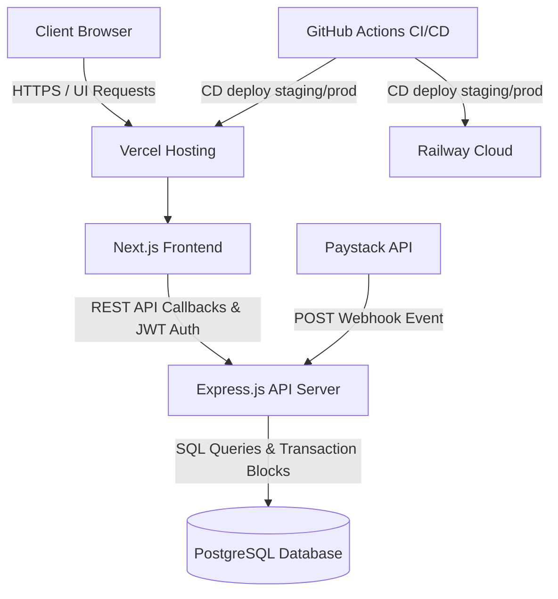

# Servia Operations Platform

A high-performance, developer-first SaaS operations and fulfillment engine for modern restaurants and hospitality groups. 

Servia replaces single-client monolithic architectures with a modular operations system featuring robust concurrency control, idempotent webhook handlers, secure authentication, and production-grade observability.

---

## System Architecture



---

## Technical Stack

- **Frontend**: Next.js App Router (TypeScript, CSS Modules) deployed on Vercel.
- **Backend**: Express.js (TypeScript, Prisma ORM, Pino logging) deployed on Railway.
- **Database**: PostgreSQL (Prisma Migrations) hosted on Railway.
- **CI/CD**: GitHub Actions (linting, type checking, Jest tests with PostgreSQL service container, manual/auto-deploy, and post-deploy health polling).
- **Payment Gateway**: Paystack Server-to-Server integration with idempotent webhook delivery checks.

---

## Local Development Setup

### Prerequisites
- Node.js (v20+)
- Docker Desktop (for PostgreSQL container)

### 1. Install Dependencies
```bash
npm install
```

### 2. Environment Configuration
Copy the `.env.example` files in both `frontend` and `backend` directories to `.env` and fill in the values:
- `backend/.env` (see example for database connection strings and JWT signing keys)
- `frontend/.env` (API endpoint mapping)

### 3. Database Migration & Seeding
```bash
# Start the Postgres container
docker compose up -d

# Deploy the database schema
cd backend
npx prisma migrate deploy

# Seed with default merchant and operator data
npx prisma db seed
```

### 4. Run Locally
Run the monorepo dev server (starts both backend and frontend):
```bash
npm run dev
```

---

## Core Case Studies (Architectural Showcases)

Servia was built with strict adherence to senior engineering principles:
1. **Idempotence**: Webhook processors check Paystack transaction reference states inside atomic blocks to prevent double-charging or double-order entry.
2. **Concurrency Control**: Reservation bookings utilize PostgreSQL **Serializable Transaction Isolation** to enforce table capacity limits under extreme load, translating database conflicts into standard client retry messages.
3. **Graceful Shutdown**: The API server implements a shutdown listener that halts new traffic, disconnects database clients cleanly, flushes Sentry telemetry queues, and exits within a strict 10s timeout budget.
